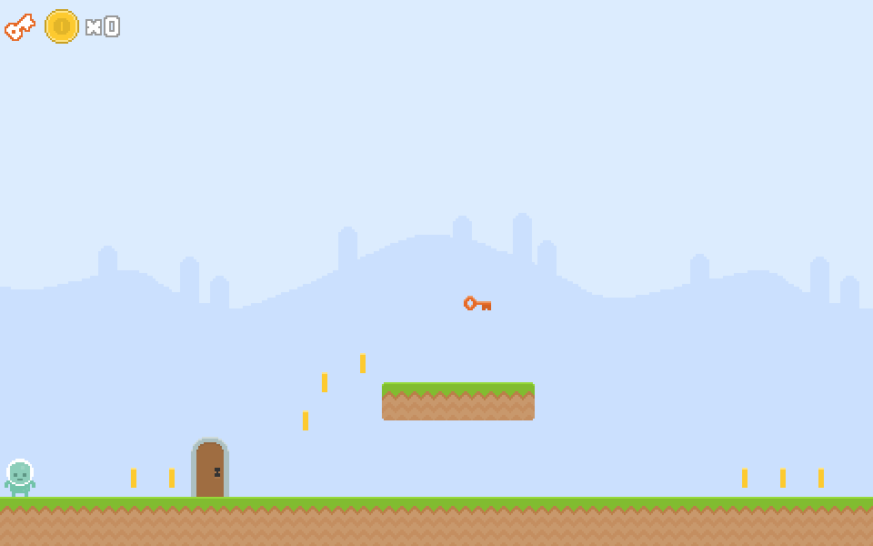

# DRAFT: Phaser 3 Platform Jumper

NOTE: This project is a work in progress and so major pieces of functionality are missing.

This project is the companion project to the [Phaser 3 Platform Jumper Workshop](https://idyllic-torrone-cf0e08.netlify.app/). 



## Get Started

Follow the steps below to run the game.

1. Clone this repo
1. Run `npm install`
1. Run `npm start`
1. Navigate to the URL in your console which should be [http://localhost:8000/](http://localhost:8000/)

```
{
	"scripts": {
		"start": "vite",
		"build": "tsc && vite build",
		"preview": "vite preview"
	},
}
```

## The Inspiration
This project is a 2D jumper game built in Phaser 3 that was heavily influenced by the excellent [HTML5 Games Workshop](https://mozdevs.github.io/html5-games-workshop/en/guides/platformer/start-here/) from [Mozilla](https://mozilla.org/).

With the release of Phaser 3, a significant number of breaking changes were introduced, necessitating a complete rewrite of the game. I am incredibly thankful for the original post, as it was the doorway to my love and appreciation for Phaser.

## The Art Assets

The graphic and audio assets of the game in this guide have been released in the public domain under a [CC0 license](https://creativecommons.org/share-your-work/public-domain/cc0/).

These assets are:

- The images have been created by [Kenney](http://kenney.nl/), and are part of his [_Platformer Art: Pixel Redux_ set](http://opengameart.org/content/platformer-art-pixel-redux) (they have been scaled up, and some of them have minor edits).
- The background music track, [_Happy Adventure_](http://opengameart.org/content/happy-adventure-loop), has been created by [Rick Hoppmann](http://www.tinyworlds.org/).
- The sound effects have been randomly generated with the [Bfxr](http://www.bfxr.net/) synth.